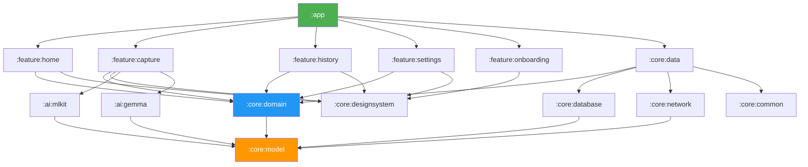

# Snaptric — Phased Development Plan

> **An Android showcase app that reads gas & electric meter values from photos using on-device AI, tracks consumption over time, and sends monthly reminders.**
>
> Target: Public GitHub repo demonstrating production-grade Android skills for the German job market.

---

## App Overview

| Aspect | Detail |
|---|---|
| **Name** | Snaptric (or MeterLens / ZählerApp) |
| **Platform** | Android (Kotlin, Jetpack Compose) |
| **Min SDK** | 26 (Android 8.0) |
| **Target SDK** | 35 |
| **Architecture** | Clean Architecture, multi-module, MVVM + UDF |
| **Key Tech** | Hilt, Room, Retrofit, CameraX, ML Kit, MediaPipe Gemma, WorkManager, Compose, Material 3 |

---

## Module & Package Structure

> **Package name**: `com.lasan.metersnap`
>
> Every module follows standard Android/Gradle conventions: `build.gradle.kts`, `src/main/kotlin/`, `src/test/kotlin/`, `src/androidTest/kotlin/`, `AndroidManifest.xml`, and `res/` where applicable.

```
snaptric/                                           # Root project
├── settings.gradle.kts                             # include(":app", ":core:model", …)
├── build.gradle.kts                                # Root build file (plugins block)
├── gradle.properties
├── gradle/
│   ├── libs.versions.toml                          # Version catalog
│   └── wrapper/
│       └── gradle-wrapper.properties
│
│── ─── BUILD LOGIC ────────────────────────────────
│
├── build-logic/
│   ├── settings.gradle.kts
│   ├── build.gradle.kts
│   └── convention/
│       ├── build.gradle.kts
│       └── src/main/kotlin/
│           ├── AndroidApplicationConventionPlugin.kt
│           ├── AndroidLibraryConventionPlugin.kt
│           ├── AndroidComposeConventionPlugin.kt
│           └── AndroidHiltConventionPlugin.kt
│
│── ─── APP MODULE ─────────────────────────────────
│
├── app/                                            # :app
│   ├── build.gradle.kts
│   └── src/
│       ├── main/
│       │   ├── AndroidManifest.xml
│       │   ├── kotlin/com/lasan/metersnap/
│       │   │   ├── MeterSnapApplication.kt         # @HiltAndroidApp
│       │   │   ├── MainActivity.kt                 # Single Activity, setContent {}
│       │   │   └── navigation/
│       │   │       ├── MeterSnapNavHost.kt          # Top-level NavHost
│       │   │       └── TopLevelDestination.kt       # Enum for bottom nav items
│       │   └── res/
│       │       ├── values/ (strings, themes)
│       │       ├── drawable/
│       │       └── mipmap-*/ (launcher icons)
│       ├── test/kotlin/com/lasan/metersnap/         # Unit tests
│       └── androidTest/kotlin/com/lasan/metersnap/  # Instrumented tests
│
│── ─── CORE MODULES ───────────────────────────────
│
├── core/
│   │
│   ├── common/                                     # :core:common
│   │   ├── build.gradle.kts
│   │   └── src/main/kotlin/com/lasan/metersnap/core/common/
│   │       ├── result/
│   │       │   └── Result.kt                       # Sealed Result<T> wrapper
│   │       ├── extensions/
│   │       │   ├── FlowExtensions.kt
│   │       │   └── DateExtensions.kt
│   │       └── di/
│   │           └── DispatchersModule.kt            # @Provides IO, Default, Main
│   │
│   ├── model/                                      # :core:model  ★ Pure Kotlin, zero Android deps
│   │   ├── build.gradle.kts                        # kotlin("jvm") — NOT android library
│   │   └── src/main/kotlin/com/lasan/metersnap/core/model/
│   │       ├── Meter.kt
│   │       ├── MeterType.kt                        # enum: GAS, ELECTRICITY, WATER
│   │       ├── Reading.kt
│   │       ├── ReadingSource.kt                    # enum: ML_KIT, GEMMA, MANUAL
│   │       └── ConsumptionStats.kt
│   │
│   ├── domain/                                     # :core:domain
│   │   ├── build.gradle.kts
│   │   └── src/
│   │       ├── main/kotlin/com/lasan/metersnap/core/domain/
│   │       │   ├── repository/
│   │       │   │   ├── MeterRepository.kt          # Interface only
│   │       │   │   └── ReadingRepository.kt        # Interface only
│   │       │   └── usecase/
│   │       │       ├── GetAllMetersUseCase.kt
│   │       │       ├── AddMeterUseCase.kt
│   │       │       ├── SaveReadingUseCase.kt
│   │       │       ├── GetReadingsForMeterUseCase.kt
│   │       │       └── GetConsumptionStatsUseCase.kt
│   │       └── test/kotlin/com/lasan/metersnap/core/domain/
│   │           └── usecase/
│   │               ├── GetAllMetersUseCaseTest.kt
│   │               ├── SaveReadingUseCaseTest.kt
│   │               └── GetConsumptionStatsUseCaseTest.kt
│   │
│   ├── data/                                       # :core:data
│   │   ├── build.gradle.kts
│   │   └── src/
│   │       ├── main/kotlin/com/lasan/metersnap/core/data/
│   │       │   ├── repository/
│   │       │   │   ├── MeterRepositoryImpl.kt
│   │       │   │   └── ReadingRepositoryImpl.kt
│   │       │   ├── mapper/
│   │       │   │   ├── MeterMapper.kt              # Entity ↔ Domain model
│   │       │   │   └── ReadingMapper.kt
│   │       │   └── di/
│   │       │       └── DataModule.kt               # @Binds for repo interfaces
│   │       └── test/kotlin/com/lasan/metersnap/core/data/
│   │           └── repository/
│   │               ├── MeterRepositoryImplTest.kt
│   │               └── ReadingRepositoryImplTest.kt
│   │
│   ├── database/                                   # :core:database
│   │   ├── build.gradle.kts
│   │   └── src/
│   │       ├── main/kotlin/com/lasan/metersnap/core/database/
│   │       │   ├── MeterSnapDatabase.kt            # @Database
│   │       │   ├── dao/
│   │       │   │   ├── MeterDao.kt                 # @Dao
│   │       │   │   └── ReadingDao.kt               # @Dao
│   │       │   ├── entity/
│   │       │   │   ├── MeterEntity.kt              # @Entity
│   │       │   │   └── ReadingEntity.kt            # @Entity
│   │       │   ├── converter/
│   │       │   │   └── InstantConverter.kt         # @TypeConverter
│   │       │   └── di/
│   │       │       └── DatabaseModule.kt           # @Provides DB + DAOs
│   │       └── androidTest/kotlin/com/lasan/metersnap/core/database/
│   │           └── dao/
│   │               ├── MeterDaoTest.kt
│   │               └── ReadingDaoTest.kt
│   │
│   ├── network/                                    # :core:network (optional cloud sync)
│   │   ├── build.gradle.kts
│   │   └── src/main/kotlin/com/lasan/metersnap/core/network/
│   │       ├── MeterSnapApiService.kt              # Retrofit @GET/@POST
│   │       ├── dto/
│   │       │   ├── MeterDto.kt
│   │       │   └── ReadingDto.kt
│   │       └── di/
│   │           └── NetworkModule.kt                # @Provides Retrofit + OkHttp
│   │
│   └── designsystem/                              # :core:designsystem
│       ├── build.gradle.kts
│       └── src/main/kotlin/com/lasan/metersnap/core/designsystem/
│           ├── theme/
│           │   ├── Theme.kt                        # MeterSnapTheme composable
│           │   ├── Color.kt                        # Curated palette
│           │   ├── Type.kt                         # Inter / Outfit typography
│           │   └── Shape.kt
│           ├── component/
│           │   ├── MeterCard.kt
│           │   ├── ReadingItem.kt
│           │   ├── EmptyState.kt
│           │   ├── MeterSnapTopAppBar.kt
│           │   └── LoadingIndicator.kt
│           └── icon/
│               └── MeterSnapIcons.kt               # Centralized icon references
│
│── ─── FEATURE MODULES ────────────────────────────
│
├── feature/
│   │
│   ├── home/                                       # :feature:home
│   │   ├── build.gradle.kts
│   │   └── src/
│   │       ├── main/kotlin/com/lasan/metersnap/feature/home/
│   │       │   ├── HomeScreen.kt                   # @Composable
│   │       │   ├── HomeViewModel.kt                # @HiltViewModel
│   │       │   ├── HomeUiState.kt                  # Sealed interface
│   │       │   └── navigation/
│   │       │       └── HomeNavigation.kt           # NavGraphBuilder.homeScreen()
│   │       └── test/kotlin/com/lasan/metersnap/feature/home/
│   │           └── HomeViewModelTest.kt
│   │
│   ├── capture/                                    # :feature:capture
│   │   ├── build.gradle.kts
│   │   └── src/
│   │       ├── main/kotlin/com/lasan/metersnap/feature/capture/
│   │       │   ├── CaptureScreen.kt
│   │       │   ├── CaptureViewModel.kt
│   │       │   ├── CaptureUiState.kt
│   │       │   ├── component/
│   │       │   │   ├── CameraPreview.kt            # CameraX PreviewView wrapper
│   │       │   │   └── MeterOverlayGuide.kt        # Rectangle frame overlay
│   │       │   └── navigation/
│   │       │       └── CaptureNavigation.kt
│   │       └── test/kotlin/com/lasan/metersnap/feature/capture/
│   │           └── CaptureViewModelTest.kt
│   │
│   ├── history/                                    # :feature:history
│   │   ├── build.gradle.kts
│   │   └── src/
│   │       ├── main/kotlin/com/lasan/metersnap/feature/history/
│   │       │   ├── HistoryScreen.kt
│   │       │   ├── HistoryViewModel.kt
│   │       │   ├── HistoryUiState.kt
│   │       │   ├── component/
│   │       │   │   └── ConsumptionChart.kt         # Compose Canvas / Vico
│   │       │   └── navigation/
│   │       │       └── HistoryNavigation.kt
│   │       └── test/kotlin/com/lasan/metersnap/feature/history/
│   │           └── HistoryViewModelTest.kt
│   │
│   ├── settings/                                   # :feature:settings
│   │   ├── build.gradle.kts
│   │   └── src/
│   │       ├── main/kotlin/com/lasan/metersnap/feature/settings/
│   │       │   ├── SettingsScreen.kt
│   │       │   ├── SettingsViewModel.kt
│   │       │   ├── SettingsUiState.kt
│   │       │   └── navigation/
│   │       │       └── SettingsNavigation.kt
│   │       └── test/kotlin/com/lasan/metersnap/feature/settings/
│   │           └── SettingsViewModelTest.kt
│   │
│   └── onboarding/                                 # :feature:onboarding
│       ├── build.gradle.kts
│       └── src/
│           ├── main/kotlin/com/lasan/metersnap/feature/onboarding/
│           │   ├── OnboardingScreen.kt
│           │   └── navigation/
│           │       └── OnboardingNavigation.kt
│           └── test/kotlin/com/lasan/metersnap/feature/onboarding/
│               └── OnboardingViewModelTest.kt
│
│── ─── AI MODULES ─────────────────────────────────
│
├── ai/
│   │
│   ├── mlkit/                                      # :ai:mlkit
│   │   ├── build.gradle.kts
│   │   └── src/main/kotlin/com/lasan/metersnap/ai/mlkit/
│   │       ├── MlKitReadingExtractor.kt            # : MeterReadingExtractor
│   │       ├── TextParsingUtil.kt                  # Digit extraction heuristics
│   │       └── di/
│   │           └── MlKitModule.kt                  # @Binds @MlKitExtractor
│   │
│   └── gemma/                                      # :ai:gemma
│       ├── build.gradle.kts
│       └── src/main/kotlin/com/lasan/metersnap/ai/gemma/
│           ├── GemmaReadingExtractor.kt            # : MeterReadingExtractor
│           ├── ModelDownloadManager.kt             # Download + cache Gemma 2B
│           └── di/
│               └── GemmaModule.kt                  # @Binds @GemmaExtractor
│
│── ─── CI / CONFIG ────────────────────────────────
│
├── .github/
│   └── workflows/
│       └── ci.yml
├── .editorconfig
├── detekt.yml
├── .gitignore
├── LICENSE
└── README.md
```

> [!IMPORTANT]
> **Why `core/model` is a separate module**: Domain models (`Meter`, `Reading`, etc.) are pure Kotlin data classes with **zero Android dependencies**. Separating them into `:core:model` (a `kotlin("jvm")` module) means they can be depended on by every other module without pulling in the Android framework. This is a hallmark of well-structured Clean Architecture projects and is the pattern used by Google's [Now in Android](https://github.com/android/nowinandroid) reference app.

### Module Dependency Graph



---

## Data Models

```kotlin
// --- Domain Models ---

enum class MeterType { GAS, ELECTRICITY, WATER }

data class Meter(
    val id: Long,
    val name: String,           // e.g., "Kitchen Gas Meter"
    val type: MeterType,
    val unit: String,           // "kWh", "m³"
    val location: String?,      // "Basement", "Hallway"
    val photoUri: String?,      // photo of the physical meter
    val createdAt: Instant
)

data class Reading(
    val id: Long,
    val meterId: Long,
    val value: Double,          // the extracted reading
    val photoUri: String,       // photo used for extraction
    val source: ReadingSource,  // ML_KIT, GEMMA, MANUAL
    val confidence: Float?,     // AI confidence score
    val timestamp: Instant,
    val note: String?
)

enum class ReadingSource { ML_KIT, GEMMA, MANUAL }

// --- Room Entities mirror these with @Entity annotations ---
// --- DTOs for optional cloud sync via Retrofit ---
```

---

## Phase 1 — Project Setup & Foundation

> **Goal**: Buildable, empty multi-module project with DI, theming, and navigation wired up.
>
> **Skills demonstrated**: Hilt, Gradle (multi-module, version catalog), Clean Architecture, Material 3, Navigation Component

### Tasks

- [ ] Create new Android project in Android Studio (Empty Compose Activity)
- [ ] Set up **Gradle version catalog** (`libs.versions.toml`) with all dependencies
- [ ] Create **multi-module structure** (app, core/*, feature/*, ai/*)
- [ ] Set up **build-logic** convention plugins for shared module config
- [ ] Configure **Hilt** in `app` module (`@HiltAndroidApp`, Hilt Gradle plugin)
- [ ] Create **design system** module:
  - Material 3 theme (light + dark)
  - Color palette (curated, not default Material colors)
  - Typography (Inter or Outfit from Google Fonts)
  - Reusable components: `MeterCard`, `ReadingItem`, `EmptyState`
- [ ] Set up **Navigation** with Compose Navigation:
  - NavHost in `app`
  - Routes: Home → Capture → History → Settings
  - Bottom navigation bar
- [ ] Add `.editorconfig` and `detekt.yml` for code style
- [ ] Initial `README.md` with project description

### Dependencies to Add

```toml
# libs.versions.toml (key entries)
[versions]
kotlin = "2.1.x"
compose-bom = "2026.x"
hilt = "2.51"
room = "2.7.x"
retrofit = "2.11.x"
camerax = "1.4.x"
mlkit-text = "16.x"
workmanager = "2.10.x"
navigation = "2.8.x"
coroutines = "1.9.x"

[libraries]
# Hilt
hilt-android = { module = "com.google.dagger:hilt-android", version.ref = "hilt" }
hilt-compiler = { module = "com.google.dagger:hilt-compiler", version.ref = "hilt" }
hilt-navigation-compose = { module = "androidx.hilt:hilt-navigation-compose", version = "1.2.0" }

# Room
room-runtime = { module = "androidx.room:room-runtime", version.ref = "room" }
room-compiler = { module = "androidx.room:room-compiler", version.ref = "room" }
room-ktx = { module = "androidx.room:room-ktx", version.ref = "room" }

# Retrofit
retrofit-core = { module = "com.squareup.retrofit2:retrofit", version.ref = "retrofit" }
retrofit-gson = { module = "com.squareup.retrofit2:converter-gson", version.ref = "retrofit" }
okhttp-logging = { module = "com.squareup.okhttp3:logging-interceptor", version = "4.12.0" }

# CameraX
camerax-core = { module = "androidx.camera:camera-core", version.ref = "camerax" }
camerax-camera2 = { module = "androidx.camera:camera-camera2", version.ref = "camerax" }
camerax-lifecycle = { module = "androidx.camera:camera-lifecycle", version.ref = "camerax" }
camerax-view = { module = "androidx.camera:camera-view", version.ref = "camerax" }

# ML Kit
mlkit-text-recognition = { module = "com.google.mlkit:text-recognition", version.ref = "mlkit-text" }

# WorkManager
workmanager-ktx = { module = "androidx.work:work-runtime-ktx", version.ref = "workmanager" }

# Testing
junit = { module = "junit:junit", version = "4.13.2" }
mockk = { module = "io.mockk:mockk", version = "1.13.x" }
coroutines-test = { module = "org.jetbrains.kotlinx:kotlinx-coroutines-test", version.ref = "coroutines" }
turbine = { module = "app.cash.turbine:turbine", version = "1.2.0" }
```

### Deliverable

✅ App builds and runs, shows empty Home screen with bottom nav, dark/light theme toggle works.

---

## Phase 2 — Data Layer (Room + Repository)

> **Goal**: Full local persistence with Room, repository pattern, and use cases.
>
> **Skills demonstrated**: Room, Clean Architecture, Coroutines, Flow, Dependency Injection

### Tasks

- [ ] Create **Room entities**: `MeterEntity`, `ReadingEntity`
- [ ] Create **DAOs**:
  - `MeterDao`: insert, update, delete, getAllMeters (Flow), getMeterById
  - `ReadingDao`: insert, getReadingsForMeter (Flow), getLatestReading, deleteReading
- [ ] Create **`MeterSnapDatabase`** with migrations strategy
- [ ] Create **mappers**: Entity ↔ Domain model
- [ ] Create **repository interfaces** in `core/domain`:
  - `MeterRepository`
  - `ReadingRepository`
- [ ] Create **repository implementations** in `core/data`:
  - `MeterRepositoryImpl` (backed by Room)
  - `ReadingRepositoryImpl` (backed by Room)
- [ ] Create **use cases** in `core/domain`:
  - `GetAllMetersUseCase`
  - `AddMeterUseCase`
  - `SaveReadingUseCase`
  - `GetReadingsForMeterUseCase`
  - `GetConsumptionStatsUseCase` (calculates delta between readings)
- [ ] Provide all via **Hilt modules** (`@Binds` for repos, `@Provides` for DB)
- [ ] Write **unit tests** for use cases with MockK

### Deliverable

✅ Data layer is fully functional and tested. Meters and readings can be created, queried, and observed via Flow.

---

## Phase 3 — Camera & ML Kit OCR

> **Goal**: Capture a photo of a meter and extract the reading using ML Kit text recognition.
>
> **Skills demonstrated**: CameraX, ML Kit, on-device AI, image processing

### Tasks

- [ ] Create `ai/mlkit` module with `MlKitTextExtractor` interface + implementation
- [ ] Set up **CameraX** in `feature/capture`:
  - Camera preview in Compose (using `PreviewView` with `AndroidView`)
  - Capture button with shutter animation
  - Image capture use case → save to app-internal storage
- [ ] Implement **ML Kit text recognition pipeline**:
  - Take captured image → `InputImage.fromFilePath()`
  - Run `TextRecognizer.process()` → get `Text` result
  - Parse digits from recognized text blocks
  - Apply heuristics: find the longest numeric sequence (likely the reading)
  - Return `ExtractionResult(value, confidence, rawText)`
- [ ] Build **Capture Screen UI**:
  - Camera preview (full screen)
  - Capture button
  - Post-capture: show extracted value with "Confirm" / "Retake" / "Edit manually"
  - Manual input fallback field
  - Save reading → Room via `SaveReadingUseCase`
- [ ] Handle **permissions**: Camera permission request with rationale dialog
- [ ] Add **image guidelines overlay** on camera preview (rectangle frame showing where to position the meter)

### Key Architecture Decisions

```kotlin
// Abstract AI extraction behind an interface for swappability
interface MeterReadingExtractor {
    suspend fun extractReading(imageUri: Uri): ExtractionResult
}

data class ExtractionResult(
    val value: Double?,
    val confidence: Float,
    val rawText: String,
    val source: ReadingSource
)

// ML Kit implementation
class MlKitReadingExtractor @Inject constructor(
    private val textRecognizer: TextRecognizer
) : MeterReadingExtractor { ... }

// Later: Gemma implementation swaps in via Hilt
class GemmaReadingExtractor @Inject constructor(
    private val llmInference: LlmInference
) : MeterReadingExtractor { ... }
```

### Deliverable

✅ User can take a photo of a meter, see the extracted reading, confirm/edit it, and save it to the local database.

---

## Phase 4 — Home Screen & Reading History

> **Goal**: Dashboard showing all meters with latest readings, and a detail view with full history.
>
> **Skills demonstrated**: Jetpack Compose (lists, cards, animations), Flow → StateFlow, MVVM, UDF

### Tasks

- [ ] Build **Home Screen**:
  - List of meter cards (LazyColumn)
  - Each card shows: meter name, type icon, last reading value, date, consumption delta
  - FAB to add new meter
  - Empty state with illustration + CTA
  - Pull-to-refresh (swipe refresh)
- [ ] Build **Add Meter Dialog/Sheet**:
  - Bottom sheet: name, type (segmented button), unit, location
  - Save → `AddMeterUseCase`
- [ ] Build **Meter Detail / History Screen**:
  - Header: meter info + photo
  - Reading history list (LazyColumn, reverse chronological)
  - Each item: value, date, source badge (ML Kit / Gemma / Manual), thumbnail
  - Swipe-to-delete on readings
  - FAB → navigate to Capture screen for this meter
- [ ] Implement **ViewModels** for each screen:
  - `HomeViewModel`: observe all meters + latest readings via Flow
  - `MeterDetailViewModel`: observe readings for specific meter
  - Use `StateFlow` + `UiState` sealed class pattern
- [ ] Add **micro-animations**:
  - Card press animation
  - Number counter animation when showing latest reading
  - Smooth list item appearance (AnimatedVisibility)

### Deliverable

✅ Full home → detail → capture flow is working end-to-end. User can manage meters and browse their reading history.

---

## Phase 5 — Consumption Charts & Analytics

> **Goal**: Visualize consumption trends with charts.
>
> **Skills demonstrated**: Compose Canvas, data visualization, domain logic

### Tasks

- [ ] Add `GetConsumptionStatsUseCase`:
  - Calculate consumption per period (monthly delta between readings)
  - Average consumption
  - Cost estimate (user sets price per unit in settings)
- [ ] Build **Chart Composable** (using Compose Canvas or a library like Vico):
  - Bar chart: monthly consumption
  - Line chart: reading values over time
  - Color-coded: green (below average) / red (above average)
- [ ] Integrate chart into **Meter Detail Screen** (collapsible section above history)
- [ ] Build **Summary Card** on Home Screen:
  - Total consumption this month across all meters
  - Month-over-month change with arrow indicator
- [ ] Add **period selector**: Last 6 months / 12 months / All time

### Deliverable

✅ Users see consumption trends at a glance. Charts render smoothly with animations.

---

## Phase 6 — WorkManager Reminders + Settings

> **Goal**: Monthly reminder notifications and user preferences.
>
> **Skills demonstrated**: WorkManager, Notifications, DataStore, foreground services awareness

### Tasks

- [ ] Create **`ReadingReminderWorker`** (extends `CoroutineWorker`):
  - Triggered periodically (user-configurable: monthly, bi-weekly, weekly)
  - Shows notification: "Time to read your meters! 📷"
  - Notification tap → opens Capture screen
- [ ] Schedule via **`PeriodicWorkRequest`** with constraints
- [ ] Build **Settings Screen**:
  - Reminder frequency toggle + picker
  - Preferred reading day of month
  - Cost per unit (for each meter type)
  - Theme preference (system / light / dark)
  - Export data as CSV
  - App version info
- [ ] Store preferences with **DataStore** (Preferences DataStore)
- [ ] Wire settings → WorkManager reschedule on change

### Deliverable

✅ Users receive timely reminders and can customize the app behavior.

---

## Phase 7 — Gemma On-Device AI (Smart Mode)

> **Goal**: Add an optional "Smart Mode" that uses Google Gemma via MediaPipe for intelligent meter reading.
>
> **Skills demonstrated**: On-device LLM, MediaPipe, AI/ML integration, model management

### Tasks

- [ ] Add `ai/gemma` module
- [ ] Integrate **MediaPipe LLM Inference API**:
  - Download Gemma 2B model (bundled or downloaded on first use)
  - Implement `GemmaReadingExtractor : MeterReadingExtractor`
  - Prompt engineering: "This is a photo of a [gas/electric] meter. Extract the current reading as a number."
- [ ] Add **model download manager**:
  - Show download progress on first use
  - Store model in app-internal storage
  - Check for model availability before offering Smart Mode
- [ ] Add **Smart Mode toggle** in Capture screen:
  - Default: ML Kit (fast, lightweight)
  - Toggle: Gemma (slower, smarter — better for analog dials, dirty meters)
  - Show which mode was used in reading history (source badge)
- [ ] Implement **Hilt qualifier** to swap implementations:

```kotlin
@Qualifier annotation class MlKitExtractor
@Qualifier annotation class GemmaExtractor

@Module
@InstallIn(SingletonComponent::class)
abstract class AiModule {
    @Binds @MlKitExtractor
    abstract fun bindMlKit(impl: MlKitReadingExtractor): MeterReadingExtractor

    @Binds @GemmaExtractor
    abstract fun bindGemma(impl: GemmaReadingExtractor): MeterReadingExtractor
}
```

- [ ] Add **fallback logic**: if Gemma fails or is unavailable, fall back to ML Kit
- [ ] Display **confidence comparison** when both are available

> [!NOTE]
> This phase is the "wow factor" for recruiters. Even if the Gemma integration is basic, having on-device LLM inference in a portfolio app is a strong differentiator for 2026.

### Deliverable

✅ Two AI modes available. Smart Mode uses on-device Gemma for harder readings. Clean abstraction via interface + Hilt.

---

## Phase 8 — Testing & CI/CD

> **Goal**: Comprehensive test coverage and automated pipeline.
>
> **Skills demonstrated**: JUnit, MockK, Espresso, Turbine, GitHub Actions, Detekt, CI/CD

### Tasks

- [ ] **Unit Tests** (target: 80%+ coverage on domain + data layers):
  - All use cases (MockK for repos)
  - Repository implementations (in-memory Room DB)
  - ViewModels (Turbine for Flow testing)
  - AI result parsing logic
- [ ] **Integration Tests**:
  - Room database operations (androidTest)
  - Full capture → save → query flow
- [ ] **UI Tests** (Espresso / Compose Testing):
  - Home screen: meter list renders correctly
  - Capture flow: permission → camera → confirm → saved
  - Navigation: all routes reachable
- [ ] **Static Analysis**:
  - Configure **Detekt** with custom rules
  - Configure **Ktlint** for formatting
- [ ] **GitHub Actions CI Pipeline** (`.github/workflows/ci.yml`):
  ```yaml
  name: CI
  on: [push, pull_request]
  jobs:
    build:
      runs-on: ubuntu-latest
      steps:
        - uses: actions/checkout@v4
        - uses: actions/setup-java@v4
          with:
            java-version: '17'
            distribution: 'temurin'
        - name: Run Detekt
          run: ./gradlew detekt
        - name: Run Unit Tests
          run: ./gradlew testDebugUnitTest
        - name: Build Debug APK
          run: ./gradlew assembleDebug
        - name: Upload APK
          uses: actions/upload-artifact@v4
          with:
            name: debug-apk
            path: app/build/outputs/apk/debug/*.apk
  ```
- [ ] Add **build status badge** to README

### Deliverable

✅ All tests pass. Every push triggers automated checks. Build badge is green on README.

---

## Phase 9 — Polish & README

> **Goal**: Make the repo irresistible to recruiters.
>
> **Skills demonstrated**: Documentation, attention to detail, communication

### Tasks

- [ ] **App polish**:
  - Splash screen (Compose splash API)
  - App icon (custom, not default Android icon)
  - Smooth transitions between screens (shared element transitions)
  - Loading states (shimmer / skeleton screens)
  - Error states with retry
  - Edge cases: no camera, empty history, very old readings
- [ ] **README.md** — the most important file:

  ```markdown
  # 📸 Snaptric
  > Read your gas & electric meters with AI — right from your phone.

  [screenshot carousel or GIF here]

  ## Features
  - 📷 Snap a photo of any meter and get an instant reading
  - 🤖 Two AI modes: Fast (ML Kit OCR) and Smart (on-device Gemma)
  - 📊 Track consumption with interactive charts
  - 🔔 Monthly reminders via WorkManager
  - 🌙 Material 3 with dark mode support

  ## Tech Stack
  | Layer | Technology |
  |---|---|
  | UI | Jetpack Compose, Material 3 |
  | Architecture | Clean Architecture, MVVM, multi-module |
  | DI | Hilt |
  | Local DB | Room |
  | Networking | Retrofit + OkHttp |
  | Camera | CameraX |
  | AI/ML | ML Kit Text Recognition, MediaPipe Gemma |
  | Background | WorkManager |
  | Async | Coroutines + Flow |
  | Testing | JUnit, MockK, Turbine, Espresso |
  | CI/CD | GitHub Actions, Detekt |

  ## Architecture
  [architecture diagram — Mermaid or image]

  ## Screenshots
  [home screen] [capture flow] [chart view] [dark mode]

  ## What I Learned
  - Implementing Clean Architecture in a multi-module Android project
  - Running on-device LLM inference with MediaPipe + Gemma
  - Designing a robust AI abstraction layer with Hilt qualifiers
  - Building custom charts with Compose Canvas

  ## Getting Started
  1. Clone the repo
  2. Open in Android Studio
  3. Run on a device with camera (or emulator for non-camera features)

  ## License
  MIT
  ```

- [ ] Add **screenshots** (at least 4: home, capture, chart, dark mode)
- [ ] Record a **30-second demo GIF** showing the capture flow
- [ ] Add **architecture diagram** (Mermaid in README)
- [ ] Add `LICENSE` file (MIT)
- [ ] Add `.gitignore` (Android-specific)

### Deliverable

✅ A polished, public-ready GitHub repository that a recruiter can understand in 30 seconds and a developer can evaluate in 5 minutes.

---

## Timeline Estimate

| Phase | Effort | Cumulative |
|---|---|---|
| Phase 1 — Setup & Foundation | 2–3 days | 2–3 days |
| Phase 2 — Data Layer (Room) | 2–3 days | ~1 week |
| Phase 3 — Camera & ML Kit | 3–4 days | ~1.5 weeks |
| Phase 4 — Home & History UI | 3–4 days | ~2 weeks |
| Phase 5 — Charts & Analytics | 2–3 days | ~2.5 weeks |
| Phase 6 — WorkManager & Settings | 2 days | ~3 weeks |
| Phase 7 — Gemma On-Device | 3–4 days | ~3.5 weeks |
| Phase 8 — Testing & CI/CD | 3–4 days | ~4 weeks |
| Phase 9 — Polish & README | 2–3 days | ~4.5 weeks |

> [!TIP]
> **After Phase 4, you already have a portfolio-worthy app.** Phases 5–9 take it from "good" to "exceptional". You can publish the repo after Phase 4 and keep iterating publicly — this also shows commit history and active development, which recruiters appreciate.

---

## Skills Coverage Checklist

After completing all phases, your repo will demonstrate:

| Skill | Phase | On CV? |
|---|---|---|
| Kotlin | All | ✅ |
| Jetpack Compose | 1, 4, 5 | ✅ |
| Android SDK | All | ✅ |
| Coroutines + Flow | 2, 3, 4 | ✅ |
| Room | 2 | ✅ (new) |
| Retrofit | 2 (optional sync) | ✅ (new) |
| Hilt | 1, 3, 7 | ✅ (new) |
| CameraX | 3 | ✅ |
| ML Kit | 3 | ✅ |
| TensorFlow Lite / Gemma | 7 | ✅ |
| Navigation Component | 1 | ✅ |
| Clean Architecture | 1, 2 | ✅ |
| MVVM | 4 | ✅ |
| WorkManager | 6 | 🆕 Add to CV! |
| Material 3 / Material Design | 1, 9 | 🆕 Add to CV! |
| JUnit + MockK | 8 | ✅ |
| Espresso | 8 | ✅ |
| GitHub Actions | 8 | ✅ |
| Gradle (multi-module) | 1 | ✅ |
| Detekt | 8 | 🆕 Add to CV! |
| Modular App Design | 1 | ✅ |
